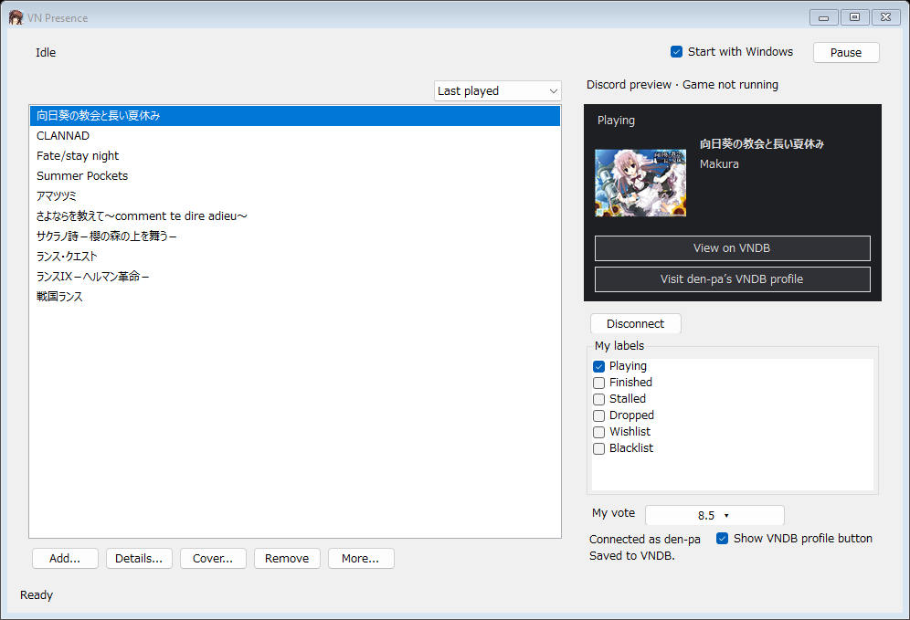
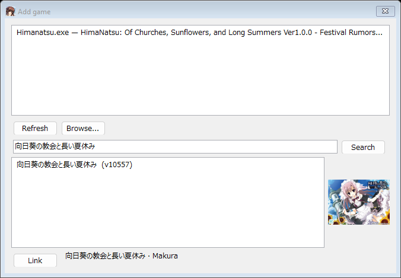
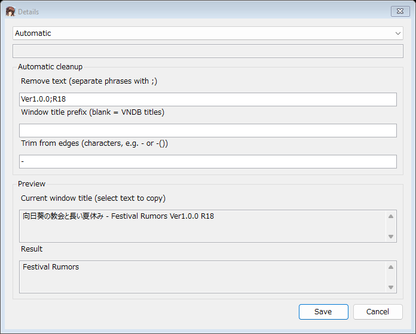
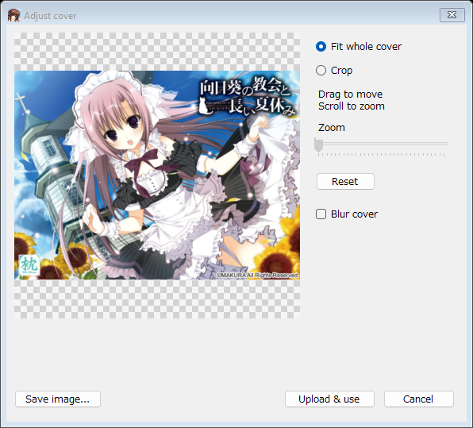
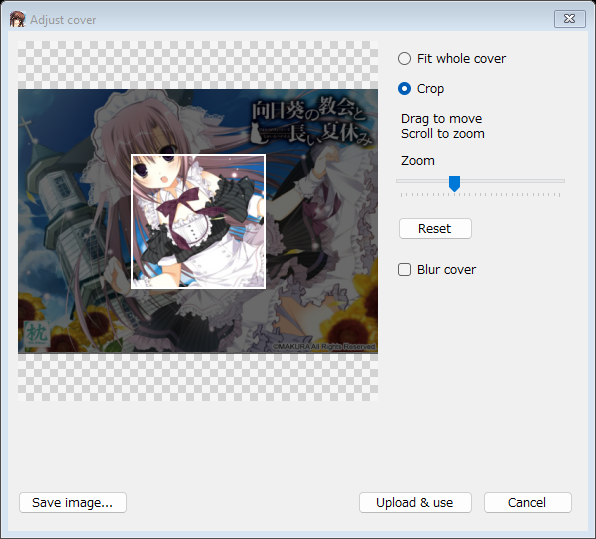
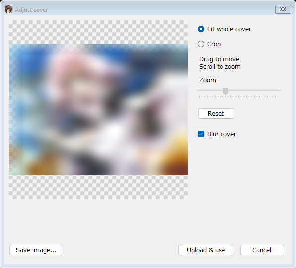
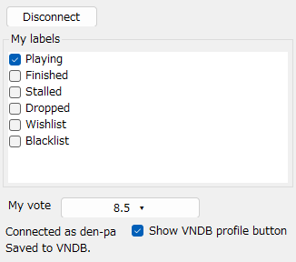
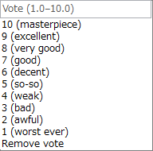

# VN Presence

A lightweight Windows app that shows the visual novel you're playing on Discord, with its title, studio, cover, game details, and elapsed time.

**Under 1 MB · Native Windows UI · Runs in the tray**

*Screenshots feature HimaNatsu; labels and the vote illustrate the account controls.*

## Install

1. Download **VN.Presence.exe** from [Releases](https://github.com/denpa39/lightweight-vn-discord-rich-presence/releases/latest). Open it directly—no installer or ZIP.
2. If prompted, install the [.NET 8 Desktop Runtime for Windows x64](https://dotnet.microsoft.com/en-us/download/dotnet/8.0), then reopen the app. Older .NET Framework 4.x isn't enough.
3. Open Discord desktop and enable **Settings → Activity Privacy → Share your detected activities**.

Requires Windows 10 or 11, 64-bit. No Discord token or Developer Portal setup needed.

## Add your games

1. Start your game and click **Add...**.
2. Select its window, or click **Browse...** to choose its executable.
3. Check the title, or paste the game's VNDB URL, then click **Search**.
4. Select the matching result and click **Link**.

Use the dropdown above your library to sort by **Added**, **Alphabetical**, or **Last played**. Your choice is saved. Last played history starts when the app records a session.

Moved a game? Use **More... → Change executable...**. **Remove** asks for confirmation.

## Discord preview and details

The preview shows your game's cover, title, studio, details, timer, and buttons. **View on VNDB** links to its game page. Discord may arrange the activity differently on desktop and mobile.

Select a game → **Details...**:

- **Automatic** reads details from the game's window title, such as its current chapter.
- **Custom** shows your own text. Leave it blank to hide the details line.
- **Remove text** removes unwanted phrases; separate them with `;`.
- **Window title prefix** handles a game name that differs from its VNDB title.
- **Trim from edges** removes surrounding characters, such as `-()`.

Check **Result**, then **Save**. Resize the Details window for longer titles and text. Chapter changes keep the play timer running.

## Show the whole cover without cropping

Discord normally displays cover artwork in a square. **Fit whole cover** keeps the entire image visible by adding transparent padding, whether the cover is tall or wide. The artwork isn't stretched or cut off.

| Fit whole cover | Square crop |
| --- | --- |
|  |  |

Open **Cover...**, select a cover, then click **Adjust... → Fit whole cover**.

Click **Upload & use**, then **Save** in the Cover window to apply it. The checkerboard represents transparency; it isn't included in the image. **Save image...** saves a PNG on your PC instead.

Choose the main VNDB cover or a release cover from the main list. **Community covers** opens a separate list below it, where you can reuse covers uploaded by other users. **Custom image...** accepts a direct public image URL, and **Default** restores the main VNDB cover.

Resize the Cover window to read longer release names. Uploading identical image bytes reuses the existing image.

Crop or blur a cover

Choose **Crop** to keep the area inside the white square. Drag or use arrow keys to move it; scroll or use **Zoom** to resize it. **Reset** starts the crop over.

Tick **Blur cover** to obscure artwork before sending it to Discord. It works with both fit and crop. Click **Upload & use**, then **Save** to apply it.

Uploaded covers are public. Blurring is optional; the app doesn't detect NSFW artwork automatically.

To undo a new upload, open **Community covers**, select one marked **(your upload)**, and click **Remove upload**. This deletes the hosted image after confirmation; anyone using the same URL may lose their cover. Removal rights stay on this PC. Uploads made before this feature cannot be verified as yours.

## VNDB labels, votes, and your profile

Click **Connect VNDB**. Create a token at [VNDB Applications](https://vndb.org/u/tokens) with both permissions:

- **Access private items on my list**
- **Add/remove/edit items on my list**

Paste the token and connect. Your password stays on VNDB.

Select a game to load its labels and vote. **Changes save automatically**—there's no Save button. Choosing Playing, Finished, Stalled, or Dropped clears the other progress labels.

Choose a rating, or type a decimal from **1.0 to 10.0** and press Enter. **Remove vote** clears an existing score.

Wait for **Saved to VNDB** before quitting. If you see **Not saved**, change the value again to retry. **Disconnect** removes the saved token.

Tick **Show VNDB profile button** beside your username to add **Visit [username]'s VNDB profile** to your Discord activity. The link comes from your connected account. Other people can see your activity buttons; Discord hides them from their owner.

## Tray, startup, and backups

- **Minimize** or **X** keeps the app running in the tray. Double-click its icon to reopen it; right-click → **Exit** to quit.
- **Pause / Resume** controls sharing. Closing the game clears its activity.
- **Start with Windows** launches it in the tray when you sign in. Keep the EXE in the same folder.
- **More... → Guide** opens the built-in guide anytime.
- **More... → Export settings... / Import settings...** transfers your games and preferences. Import replaces your current settings after confirmation. Connect VNDB again on another PC; the token isn't exported.

Your settings carry across app updates.
